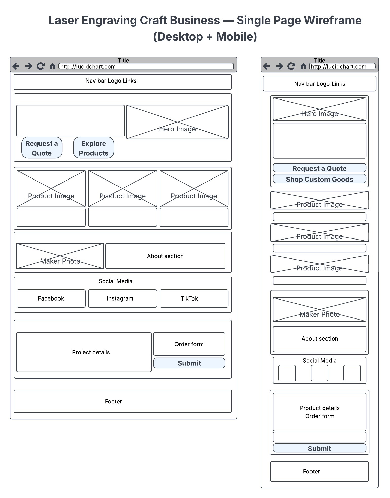

# Pauly Bruv Engraving | Bespoke Laser Artistry & Custom Gifts

Pauly Bruv Engraving is a responsive, single-page showcase and custom quote request website built for a Birmingham-based precision laser engraving workshop. The site highlights bespoke slate coasters, 3D layered MDF signage, localized merchandise, and commercial point-of-sale displays.

---

## Table of Contents

1. [Project Overview & UX](#project-overview--ux)
2. [Target Audience & User Goals](#target-audience--user-goals)
3. [Design & Styling Decisions](#design--styling-decisions)
4. [Wireframes](#wireframes)
5. [Features & Structure](#features--structure)
6. [Technologies Used](#technologies-used)
7. [Testing & Validation](#testing--validation)
8. [Deployment](#deployment)
9. [Credits & Acknowledgments](#credits--acknowledgments)

---

## Project Overview & UX

The primary objective of this site is to showcase artisan laser-crafted products, build brand trust through workshop imagery, and provide a low-friction inquiry path for bespoke customer commissions.

### User Stories

- **As a first-time visitor**, I want to quickly understand what materials and products the workshop specializes in.
- **As a potential customer**, I want to view high-resolution examples of past commissions and merchandise displays.
- **As a gift buyer**, I want to submit custom dimensions, artwork requests, or wording through an easy-to-use form to receive a quote.
- **As a social media user**, I want direct links to watch behind-the-scenes engraving videos and workshop drops on TikTok, Instagram, and Facebook.

---

## Design & Styling Decisions

### Color Palette

The color scheme was chosen to reflect natural workshop materials (slate stone, laser-cut timber, warm wood tones, and clean presentation surfaces):

- **Canvas Background (`#f8f7f4`):** Soft alabaster base that reduces eye strain compared to pure white.
- **Primary Charcoal (`#1a1a1a`):** Slate-inspired dark tone for clear text hierarchy, navigation, and main buttons.
- **Artisan Bronze / Timber Accent (`#8c6d46`):** Warm accent color used for icons, interactive hover states, active indicators, and focus outlines.
- **Panel & Card Surface (`#ffffff`):** Crisp white elevated islands to segment sections and frame content cleanly.
- **Matte Carousel Canvas (`#f1efe9`):** Neutral warm stone backing to allow uncropped workshop photos of varying aspect ratios to sit comfortably without distortion.

### Typography

- **Headings:** `'Noto Serif Display'`, Georgia, serif — provides an authentic, crafted editorial feel.
- **Body Text:** Modern System UI sans-serif stack (`-apple-system`, `BlinkMacSystemFont`, `Segoe UI`, `Roboto`) — ensures high legibility across mobile and desktop devices.

---

## Wireframes

Wireframes were produced during the initial UX planning stage to map out responsive layout transitions, section order, and content hierarchy prior to development:

- **Site Wireframe:** [View Wireframe Design](assets/images/pbe-wireframe.png)

---

## Features & Structure

- **Sticky Navigation Bar:** Retains brand logo and links (`Home`, `Products`, `About the Maker`, `Follow Us`, and `Custom Quote` CTA) with mobile hamburger toggle support.
- **Hero Island Panel:** Direct value proposition with clear headline, dual CTAs, and a 3-point workshop guarantee checklist.
- **Featured Products Showcase:** 3-column responsive card grid highlighting pricing, descriptions, and CTAs for core product ranges.
- **Interactive Workshop Carousel:** 4-slide showcase displaying custom wood bar signs, 3D printed/engraved POS stands, and display sets with containment styling (`object-fit: contain`).
- **Social Community Hub:** Responsive cards linking out to TikTok, Instagram, and Facebook with secure `rel="noopener noreferrer"` attributes.
- **Quote Request Form & Feedback Page:** Interactive multi-field form with field validation (`name`, `email`, `projectType`, `message`) that directs users to a dedicated `thank-you.html` confirmation screen upon submission.

---

## Technologies Used

- **HTML5:** Semantic document structure (`<header>`, `<nav>`, `<main>`, `<section>`, `<article>`, `<footer>`).
- **CSS3:** Custom properties (variables), Flexbox, CSS Grid, media queries, and transition micro-interactions.
- **Bootstrap 5.3.3:** Responsive grid framework, navbar collapse component, and carousel functionality.
- **Font Awesome 6.5.1:** Vector icons for UI navigation, feature bullet points, and social badges.
- **Google Fonts:** Embedded `Noto Serif Display` web font.

---

## Testing & Validation

### Lighthouse Quality & Performance Audits

Audits were conducted using Google Chrome DevTools to measure performance, accessibility, best practices, and SEO across both Desktop and throttled Mobile profiles:

| Environment | Performance | Accessibility | Best Practices | SEO | Core Web Vitals Summary |
| :--- | :---: | :---: | :---: | :---: | :--- |
| **Desktop** | **98** | **96** | **100** | **100** | **FCP:** 0.9s \| **LCP:** 0.9s \| **TBT:** 0ms \| **CLS:** 0.005 |
| **Mobile** | **84** | **96** | **100** | **100** | **FCP:** 2.1s \| **LCP:** 4.3s \| **TBT:** 0ms \| **CLS:** 0.001 |

#### Performance Optimizations Implemented
- **Hero LCP Preloading:** Configured `<link rel="preload" as="image" ... fetchpriority="high">` to discover and fetch the primary banner image on initial parse.
- **Image Compression & WebP Conversion:** Converted key raster assets to modern WebP format and scaled dimensions, cutting initial load payload by over 90%.
- **Native Lazy Loading:** Applied `loading="lazy"` to below-the-fold product cards and carousel imagery to defer offscreen downloads.
- **Cumulative Layout Shift (CLS) Prevention:** Explicit `width` and `height` dimensional attributes declared on all image tags.

---

### Code Validation

- **W3C Nu HTML Checker:** Passed with **0 errors and 0 warnings**.
- **W3C CSS Validation Service (Jigsaw):** Passed with **0 errors** (validated to CSS Level 3 + SVG).
  - *Note on CSS Warnings:* 2 warnings pertain to dynamic CSS custom properties (`var(--...)`), and 1 informational warning notes identical `background-color` and `border-color` pairing on hover states.

---

### Responsiveness & Cross-Browser Testing

- Tested across small mobile (320px–480px), tablet (768px–1024px), and desktop viewports (1200px+).
- Verified compatibility and visual consistency across Google Chrome, Mozilla Firefox, Microsoft Edge, and Safari.
- Responsive hamburger menu navigation and interactive touch carousel slides verified on touchscreen devices.

---

### Form Verification

- HTML5 validation constraints (`required` attributes and `type="email"`) ensure complete submissions.
- Form submissions redirect to `thank-you.html` with a clear confirmation state and navigation back to the workshop homepage.

---

### Accessibility (a11y)

- Semantic HTML5 landmark structure (`<header>`, `<nav>`, `<main>`, `<section>`, `<article>`, `<footer>`).
- Form controls paired with explicit `<label for="...">` tags.
- Descriptive `alt` text provided on all meaningful images.
- Outbound external links secured with `rel="noopener noreferrer"` attributes.

---

## Deployment

1. The project repository is hosted on **GitHub**.
2. Live deployment is published via **GitHub Pages**:
   - Repository settings > **Pages** > Branch set to `main` / `root`.
   - Live URL: [https://paulybruv.github.io/pauly.bruv/](https://paulybruv.github.io/pauly.bruv/)

---

## Credits & Acknowledgments

- Workshop product photography and laser engraving designs provided by **Pauly Bruv Engraving**.
- Icons provided by [Font Awesome](https://fontawesome.com/).
- Typography provided by [Google Fonts](https://fonts.google.com/).
- Responsive layout system provided by [Bootstrap 5](https://getbootstrap.com/).